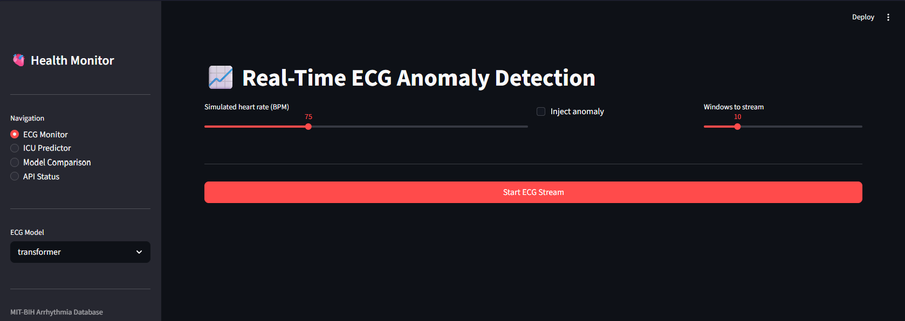

# Health Monitor

Real-time ECG anomaly detection and ICU deterioration prediction using CNN, Transformer, VAE autoencoders and a BiLSTM with attention.



---

## Setup

```bash
python -m venv .venv
.venv\Scripts\activate
pip install -r requirements.txt
```

## Run

**Terminal 1 — API:**
```bash
uvicorn src.api.main:app --reload --port 8000
```

**Terminal 2 — Dashboard:**
```bash
streamlit run src/app.py
```

Open `http://localhost:8501` for the dashboard or `http://localhost:8000/docs` for the API.

---

## Train models

```bash
python src/models/cnn_autoencoder.py
python src/models/transformer_ae.py
python src/models/vae.py
python src/models/icu_predictor.py
```

---

## Data

ECG models use the [MIT-BIH Arrhythmia Database](https://physionet.org/content/mitdb/1.0.0/). ICU model uses synthetic vital sign data.
